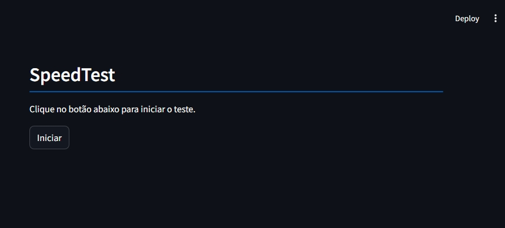
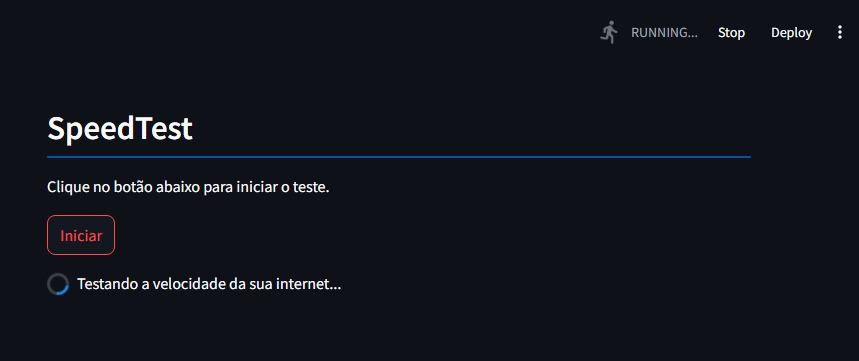
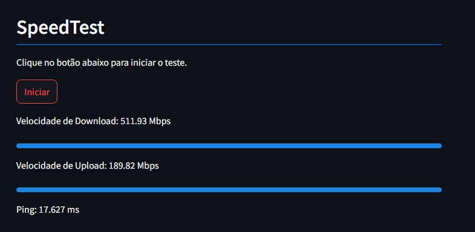

# 🌐 SpeedTest App

Bem-vindo ao **SpeedTest App**, uma aplicação em Python desenvolvida com o Streamlit que permite medir a velocidade de download e upload da sua conexão de internet e visualizar os resultados instantaneamente!

## 🚀 Funcionalidades Principais

1. **Teste de Velocidade**:
   - Mede a velocidade de download e upload da sua internet e exibe os valores em Mbps.
   - Exibe o valor do ping em milissegundos para avaliação da latência.

2. **Indicador de Progresso**:
   - Durante o teste, barras de progresso indicam a velocidade de download e upload como uma proporção de uma velocidade máxima de referência (100 Mbps).

3. **Feedback Visual**:
   - Mostra um spinner enquanto o teste de velocidade está em andamento para informar o usuário sobre o processo.

## 🖼️ Interface do Aplicativo

### Tela 1 - Tela principal


### Tela 2 - Tela de testando a velocidade


### Tela 3 - Tela de teste finalizado


### Tela Principal
- Exibe um cabeçalho com o nome do aplicativo e uma breve descrição.
- Possui um botão "Iniciar" para iniciar o teste de velocidade.
- Após clicar no botão, o app calcula a velocidade de download, upload e ping, e mostra os resultados com barras de progresso.

## 🛠️ Tecnologias Utilizadas

- **Streamlit**: Framework para desenvolvimento de aplicativos web em Python de forma rápida e interativa.
- **Speedtest**: Biblioteca em Python que permite realizar testes de velocidade de internet.

## 📦 Instalação e Uso

1. Clone este repositório:
   ```bash
   git clone https://github.com/BernardoDetomi/SpeedTestApp.git
   ```

2. Navegue até o diretório do projeto:
   ```bash
   cd SpeedTestApp
   ```

3. Instale as dependências:
   ```bash
   pip install -r requirements.txt
   ```

4. Inicie o aplicativo:
   ```bash
   streamlit run app.py
   ```

5. O aplicativo abrirá em um navegador local (geralmente `http://localhost:8501`), onde você pode realizar o teste de velocidade.

## 📋 Estrutura do Código

- **Importações**:
   - `streamlit`: Utilizado para criar a interface do usuário.
   - `speedtest`: Biblioteca para realizar os testes de velocidade.

- **Função principal (`main`)**:
   - `st.header("SpeedTest", divider=True)`: Exibe o cabeçalho do aplicativo.
   - `st.write("Clique no botão abaixo para iniciar o teste.")`: Mostra uma breve instrução para o usuário.
   - `if st.button('Iniciar')`: Inicia o teste de velocidade quando o botão é pressionado.
   - Dentro do bloco `if`:
     - Um spinner indica o andamento do teste.
     - Inicializa um objeto `Speedtest`.
     - Mede a velocidade de download e upload (convertidas para Mbps).
     - Exibe os valores de velocidade com barras de progresso e o ping.

## 🆘 Suporte  

Se você encontrar algum problema ou tiver dúvidas, sinta-se à vontade para abrir uma issue no repositório ou entre em contato:  

- **Email**: bernardomd01@gmail.com 
- **Twitter**: @Bernardo_md  
- **Instagram**: @bernardoo.md  

## Contribuições  

Contribuições são bem-vindas! Sinta-se à vontade para contribuir com novas funcionalidade para o SmartBite.AI e para abrir problemas (issues) ou enviar pull requests com melhorias! Toda ajuda é bem-vinda.    

## Autores  
 
- Bernardo Maia Detomi.
